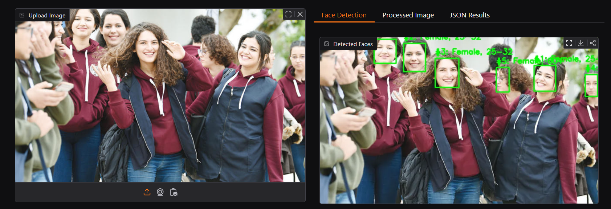
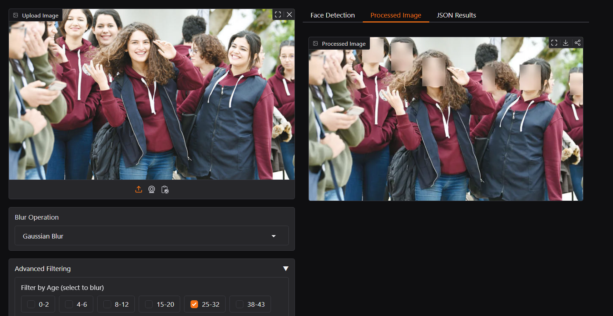
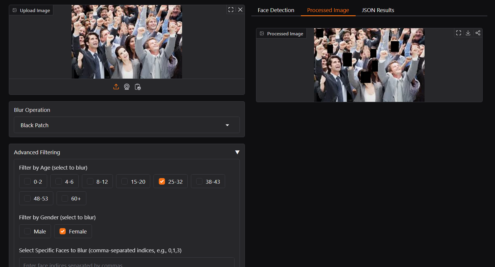
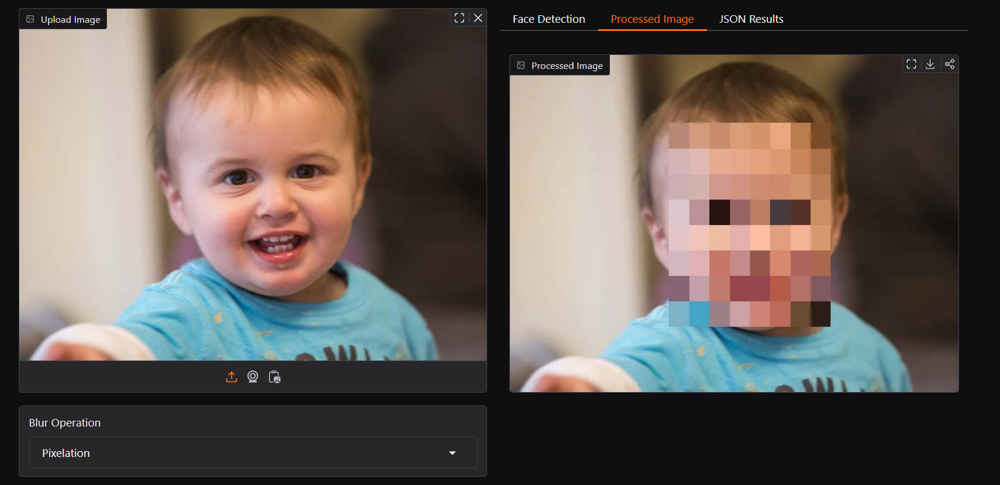

# project_anon

### Problem Statement - WHCS02 / Open Innovation

---
### Live Link: https://huggingface.co/spaces/intuitive262/project_anon

---

## **Introduction**
- ### ***project_anon*** is an effective way to anonymize people or any sensitive sectors in an image.

- ### The project has been created with the sole purpose of eliminating the risk of accidental or intentional invasion of other's privacy.

- ### To use it:

    - Upload an image/video
    - Use the filters provided:
        > - age (classified into age groups as: **tbd**)

        > - gender (classified into **male/female**)

    - or select a sensitive sector (e.g. faces or any objects) that you wish to blur out or privatise, i.e.

        > - choose from the **faces** shown as a list:

        > - the app will automatically detect and blur out the face everytime it locates it anywhere in the video stream.

---

## **Workfolow**

- **Face Detection:** I'm using the [Ultra Light Fast Generic Face Detector - 1MB](https://github.com/Linzaer/Ultra-Light-Fast-Generic-Face-Detector-1MB) which is a very lightweight and fast face detection model.

- **Age/Gender Detection and Blurring:**
    - I'm using the OpenCV DNN Face Detection Models for Age and Gender Detection which have a small size (~30 MB each) and are pretty efficient and fast at age/gender estimation (~0.2-0.3 ms per face)
    - The web-app has several filters such as for:
        - age filters:
            > the age classes are: ['0-2', '4-6', '8-12', '15-20', '25-32', '38-43', '48-53', '60+']

        - gender filters:
            > Male / Female

        - the operation to perform to implement anonymization, viz.
            > Gaussian Blur

            > Black Patch (Simple Occlusion)

            > Pixelation

- **Selective Blurring:**
    - Another prominent feature is a selective blurring feature where you can enter indices for the faces that have been identified in the image and the corresponding faces would be anonymized.

    - To use this, you can check the **JSON results** or the **Face Detection** tab alongside the processing tab.
    

- **Example Output:**
    - Gaussian Blur

    > Filters:

    >> Age: 25 - 32
            
    

    - Black Patch

    > Filters:

    >> Age: 25 - 32

    >> Gender: Female

    

    - Pixelation
    
    > Filters: None

    